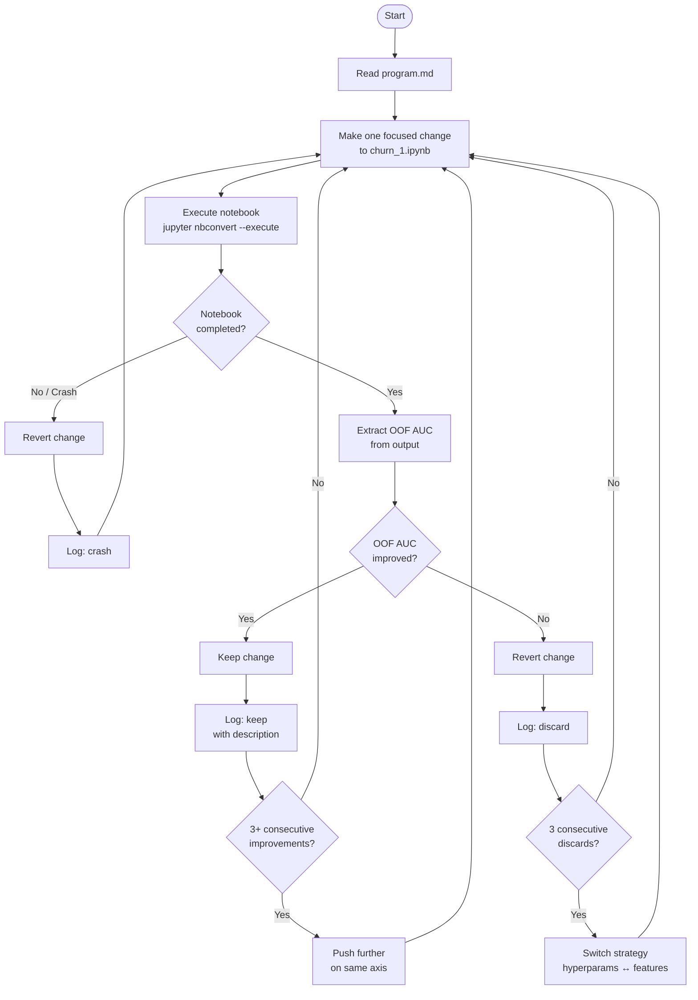

## What Is AutoResearch?

In March 2026, Andrej Karpathy — former Tesla AI Director and co-founder of OpenAI — released a deceptively simple open-source project called **AutoResearch**. The premise: what if an AI agent could run your ML experiments overnight without any human in the loop?

The traditional ML research workflow looks like this: you have a hypothesis ("what if I increase the number of leaves in my LightGBM model?"), you edit your code, kick off a training run, wait, evaluate the result, decide whether to keep it, and repeat. For a serious competition, you might run 20–30 such experiments over a weekend. It's slow, it's manual, and most of the time you're just waiting.

AutoResearch automates that entire loop.

You write a plain English file called `program.md` — essentially a research brief — that tells the agent what to optimise, what it's allowed to change, and what's off-limits. The agent then runs experiments autonomously, keeping changes that improve performance and discarding those that don't, logging every result. You come back the next morning to find 50+ experiments completed.

Karpathy's first overnight run on a GPT training script yielded 50 experiments and an **11% training speed improvement** with no human input. Shopify CEO Tobias Lütke reported a **19% performance gain** after a single overnight run of 37 experiments. The repo gained over 8,000 GitHub stars within days of release.

## A Brief History

| Date | Event |
|---|---|
| 2026-03-17 | Karpathy releases AutoResearch publicly |
| 2026-03-17 | First reported overnight run: 50 experiments, 11% speed gain on GPT training |
| 2026-03-18 | Tobias Lütke (Shopify) reports 19% gain from 37 autonomous experiments |
| 2026-03-18 | Repo hits 8,000+ GitHub stars |
| 2026-03-23 | First application to Kaggle competition (this post) |

The project is intentionally minimal — a 630-line Python script and a markdown file. Karpathy's stated vision is for agents to eventually operate asynchronously and collaboratively, like a distributed research community rather than a single PhD student.

## Why Use It for a Kaggle Competition?

The [Kaggle Playground Series S6E3](https://www.kaggle.com/competitions/playground-series-s6e3) — Predict Customer Churn — has a tight leaderboard. The top score is **0.9176 ROC-AUC** and the top 20 submissions are all within 0.001 of each other. In a competition like this, the wins come from systematically searching the hyperparameter and feature space — exactly what AutoResearch is designed for.

Doing this manually would take days. With AutoResearch:
- Each experiment runs in ~15 minutes
- That's ~4 experiments per hour
- An overnight run (~10 hours) gives ~40 experiments
- The agent finds improvements that a human would likely miss or not bother trying

There's also a discipline benefit. The agent makes **one change at a time** and logs every result — which is actually better experimental hygiene than most humans practice.

## The Three-File Architecture

AutoResearch is built around three files:

```
prepare.py   ← data loading and utilities (agent never touches this)
train.py     ← the model / training loop (agent edits this freely)
program.md   ← your plain English instructions to the agent
```

For a Kaggle competition we map these to:

```
data/churn/          ← raw CSVs (never touched)
churn_1.ipynb        ← feature engineering + model training (agent edits this)
program.md           ← experiment instructions
results.tsv          ← append-only experiment log
```

## How We Set It Up

### Step 1 — Build a Baseline Solution Manually

Before AutoResearch can iterate, you need a solid starting point. We built ours manually:

**Feature engineering** (31 features from 20 raw columns):
- Binary-encoded all Yes/No columns
- Ordinal-encoded `Contract`, `InternetService`, `PaymentMethod`
- Derived features: `ChargeConsistency`, `NumServices`, `ServicesPerDollar`, `MtMFiber`, `TenureGroup`
- Log-transformed skewed numeric columns

**Model: OOF Stacking**
- Three base models trained with 5-fold cross-validation
- Out-of-fold probabilities fed to a Logistic Regression meta-learner
- Baseline OOF AUC: **0.91663** | First LB submission: **0.91406**

### Step 2 — The Critical Lesson: Submit Probabilities, Not Labels

Our very first submission scored **0.771** instead of the expected ~0.914. The mistake: submitting binary 0/1 predictions instead of continuous probabilities.

ROC-AUC is a ranking metric — it needs a continuous score to sort predictions. Submitting hard labels collapses all ranking information. After fixing this, our score jumped to 0.914 on the first resubmission.

**Rule: for any AUC competition, always submit `predict_proba()[:,1]`, never `predict()`.**

### Step 3 — Write `program.md`

With a working baseline, we wrote `program.md` — the agent's instruction manual. Key sections:

- **Target**: beat OOF AUC 0.91663, LB target 0.9176+
- **Experiment loop**: modify notebook → execute → extract OOF AUC → keep/discard → log
- **Permitted changes**: hyperparameters, feature engineering, ensemble composition
- **Off-limits**: raw data, submission format, OOF evaluation pattern
- **Decision rules**: keep if any improvement; after 3 consecutive discards, switch strategy
- **Starting experiments**: specific suggestions to try first

## The Experiment Flow



## How We Iterated (Manual Phase)

Before handing off to AutoResearch, we ran a manual iteration cycle on the Titanic competition that taught us the most important lessons about what the agent would need to get right.

| Version | Change | OOF | LB |
|---|---|---|---|
| v1 | Baseline ensemble, train-only features | 0.846* | 0.763 |
| v2 | Fixed leakage: engineer on combined data | 0.830 | 0.763 |
| v3 | Added family/ticket survival rates (leaked into CV) | 0.866* | 0.766 |
| v4 | Proper OOF survival rates — no leakage | 0.824 | 0.768 |
| v5 | Stacking + feature selection (top 16 features) | 0.830 | 0.770 |
| v6 | Stronger meta regularisation + group override | 0.829 | **0.775** |

*Inflated due to target leakage.

**Key lessons that shaped program.md:**
1. Fix leakage before adding features — inflated CV is a red flag, not a win
2. One change at a time — combining feature + hyperparameter changes makes it impossible to know what worked
3. Log everything — even discarded experiments show you where not to go

## Current Scores

| Competition | Metric | Our Best | Top LB | Gap |
|---|---|---|---|---|
| Titanic | Accuracy | 0.775 | ~0.840 | 0.065 |
| Customer Churn | ROC-AUC | **0.914** | 0.9176 | 0.003 |

The churn competition gap is only **0.003 AUC** — well within reach of systematic hyperparameter tuning. This is exactly the kind of gap AutoResearch is built to close.

## What Happens Next

With `program.md` written and a baseline at 0.914, the next step is to run the AutoResearch loop overnight:

```bash
# Start an agent session and hand it the program
"Read program.md and start the experiment loop on the churn notebook."
```

The agent will run experiments through the night — tuning `num_leaves`, `max_depth`, `reg_alpha`, trying new feature interactions — appending every result to `results.tsv`. The goal: push past 0.9176 and compete for swag.

## Why This Matters Beyond Kaggle

AutoResearch represents a shift in how ML work gets done. The bottleneck in most ML projects isn't knowing *what* to try — it's having the time to try it systematically. By delegating the experiment loop to an agent, you spend your time on the hard parts: problem framing, feature intuition, and deciding what to optimise.

Karpathy's vision is for this to scale to asynchronous collaborative agents, each exploring different parts of the search space in parallel. For now, even the single-agent overnight loop is a meaningful productivity multiplier.

The key insight is that `program.md` is the human's contribution — the research taste, the domain knowledge, the constraints. The agent handles the execution. That's a good division of labour.

*Code for this project: [github.com/atodev/auto-research](https://github.com/atodev/auto-research)*
*AutoResearch repo: [github.com/karpathy/autoresearch](https://github.com/karpathy/autoresearch)*
